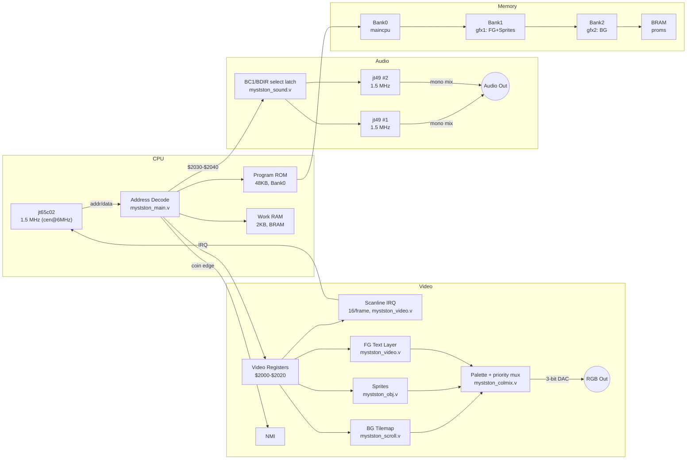

# MYSTSTON — Mysterious Stones: Dr. John's Adventure

FPGA recreation of **Mysterious Stones: Dr. John's Adventure** (Technos Japan, 1984 — board
TA-0010) arcade hardware, built on the [**JTFRAME**](https://github.com/jotego/jtframe) framework
(Jose Tejada / jotego)

> ⚠️ **AI-generated core.** Uses jotego's JTFRAME framework (GPLv3). Not a jotego core, nor affiliated with
> or endorsed by him.
>
> This is **not a hardware-preservation effort**. It's a study/learning exercise: the HDL and
> documentation were built by reading the MAME driver source and a set of schematic scans, not by
> independently verifying anything against a real PCB. Treat every hardware claim in `doc/` as
> "this is what the reference material says," not as measured fact — see
> [Open Questions & Pending Hardware Verification](#open-questions--pending-hardware-verification)
> for what remains genuinely unconfirmed.

## Documentation

This README covers the essentials. Full technical detail lives in `doc/`, split by topic:

| Doc | Covers |
|---|---|
| [doc/HARDWARE.md](doc/HARDWARE.md) | Real PCB reference: board set, CPU, clocks, video, audio, inputs — drawn from direct review of schematic pages |
| [doc/HISTORY.md](doc/HISTORY.md) | Game history, trivia, romset versions/clones, MAME driver timeline |
| [doc/MEMORY_MAP.md](doc/MEMORY_MAP.md) | CPU memory map, I/O registers, interrupts, dipswitches |
| [doc/IMPLEMENTATION.md](doc/IMPLEMENTATION.md) | How the hardware maps onto this JTFRAME core: CPU IP choice, clocks, SDRAM layout, modules reused, known gotchas |

Machine-readable versions of the hardware reference are also in `doc/`: `board_spec.json`
(pre-implementation facts) and `enrichment.json` (schematic-derived detail).

## Hardware summary

**Mysterious Stones** runs on Technos Japan's TA-0010 hardware, a 2-PCB set:
**6502A** @ 1.5MHz + 2x **AY8910** @ 1.5MHz + discrete-TTL video (BG tilemap, FG text layer,
sprites) + two PAL16R4/one PAL10L8 handling layer priority. See
[doc/HARDWARE.md](doc/HARDWARE.md) for full detail.

| Component | Details |
|-----------|---------|
| Main CPU | 6502A @ 1.5MHz (12MHz master XTAL / 8) |
| Sound | 2x AY8910 @ 1.5MHz + M51516 audio power amp |
| Video | 256x240 @ 57.44Hz, vertical, 6MHz pixel clock |
| Layers | BG tilemap (16x16 tiles), sprites (16x16, ~24 max), FG text (8x8 tiles) |
| Palette | 64 entries: 32 dynamic RAM + 32 fixed PROM (82S123, 3-bit DAC) |
| SDRAM | 2 graphics banks (FG+sprites, BG) + program-ROM bank; color PROM in BRAM |

## Open Questions & Pending Hardware Verification

The core builds, boots, and runs all three variants, but the items below have **not** been
confirmed against a real TA-0010 board — either because MAME's own driver documents them as
unverified assumptions, or because confirming them would require a physical board this project
doesn't have access to.

### What MAME's own driver documents as unverified

Straight from `technos/mystston.cpp`'s change history (MAME 0.288, `[hap]`):

> Added TODO note, vblank flag was wrong way around here too (eg. it started writing gfx at the
> start of active display area instead of at start of vblank). **Assume it has 16 interrupts per
> frame.** Added TODO note about vcount timing.

In other words, even the reference emulator treats the 16-interrupts-per-frame scanline cadence as
an *assumption*, not something hardware-verified, and carries its own open TODO about vcount
timing and vblank-flag polarity. This core's scanline-IRQ generator (`mystston_video.v`) inherits
that same assumption — it reproduces MAME's documented behavior, not an independently confirmed
one.

By contrast, the 57.444853Hz refresh rate *is* community-measured against real hardware — it was
explicitly corrected against a real PCB in MAME 0.113u2/0.135u4 (Kold666: "VSync does not match
original PCB") — so that value can be trusted more than the interrupt-cadence assumption above.

### Layer priority / color-select logic

Per [doc/HARDWARE.md](doc/HARDWARE.md#video), two PAL16R4 chips plus one PAL10L8 almost certainly
decide real sprite/background layer priority and final color selection, feeding a latch labeled
`OBJCG`. Their fuse equations are **not dumped** for the original TA-0010 board (only for the
`myststonoi` Itisa clone, and MAME doesn't even use that dump for emulation — see
[doc/HISTORY.md](doc/HISTORY.md#versions--romsets)). This core's priority mux
(`mystston_colmix.v`, foreground > sprites > background) was derived from MAME driver source, not
from those PALs' actual logic — it matches MAME's *observable behavior*, which is not the same
guarantee as matching the *real gate-level equations*.

### Audio

The real mixing resistor network and Mitsubishi M51516 power-amp values are now documented (see
[doc/HARDWARE.md](doc/HARDWARE.md#audio)), but this core's `rsum` gain values (`cfg/mem.yaml`)
were chosen algorithmically by the framework, not measured from the real network's actual output
level or frequency response.

### Measurements that would need a real board

- Oscilloscope capture of HSYNC/VSYNC/composite sync and pixel clock, compared against this core's
  generated timing.
- IRQ line assertion timing relative to vblank — the concrete way to resolve the vcount-timing TODO
  quoted above instead of inheriting MAME's assumption.
- Coin-switch NMI pulse width/hold duration, to confirm `jt65c02`'s edge-sensitive NMI handling
  matches the real level-held signal described in `enrichment.json`'s schematic findings.
- A JEDEC/fuse-map dump of the two PAL16R4 + PAL10L8 on an actual parent-board chip (or locating
  an existing dump in the preservation community) — the only way to fully resolve the layer-priority
  question above instead of approximating it from MAME driver source.

## Block diagram



## Core structure

See [doc/IMPLEMENTATION.md](doc/IMPLEMENTATION.md#core-structure) for the full file list and
per-module notes (CPU IP choice, clock domains, SDRAM layout, JTFRAME modules reused).

## Build

This core uses [JTFRAME](https://github.com/jotego/jtcores/tree/master/modules/jtframe) (Jose Tejada / jotego).

1. Clone [arcfpga-cores](https://github.com/bmo00/arcfpga-cores) (brings arcfpga-frame + shared
   modules as submodules) — this core lives at `cores/mystston/`
2. Generate: `jtcore mystston -mister`
3. Compile with Quartus (or use Docker: `jotego/jtcore24`)

Core layout:
```
cores/mystston/
├── hdl/    Verilog source
├── cfg/    macros.def, mem.yaml, files.yaml, mame2mra.toml
├── doc/    Hardware reference, history, memory map, implementation notes, schematics
└── releases/
    ├── mra/    MRA files for MiSTer
    └── rom/    ROM files (user-provided)
```

## ROMs

**Not included** (copyrighted material). The `.mra` files expect MAME's **merged** romset for
`technos/mystston.cpp` — a single `mystston.zip` archive (named after the parent set) that already
bundles the ROMs for all three variants (`mystston`, `myststono`, `myststonoi`) inside it, not
three separate split/non-merged zips. See [doc/HISTORY.md](doc/HISTORY.md#versions--romsets) for
what differs between the variants the `.mra` files can select from that one archive.

## Credits

- **Technos Japan** — original developer/manufacturer of Mysterious Stones (1984, board TA-0010).
  The schematic set this core's hardware documentation is based on was drafted/produced by
  データイースト株式会社 (Data East Co., Ltd.)
- **Jose Tejada (jotego)** — [JTFRAME](https://github.com/jotego/jtframe) framework and the wider
  body of open-source arcade FPGA preservation work it's part of, including the `jt65c02`
  (`modules/jt680x`) CPU core and `jt49` AY8910 sound core this core reuses directly.
- **MAME / MAMEdev and contributors** — this core's software behavior was reverse-engineered from
  the `technos/mystston.cpp` driver. Original driver by **Nicola Salmoria** (MAME 0.25, 1997);
  substantially extended and corrected since by **David Haywood**, **Curt Coder**, **Zsolt
  Vasvari**, **Kold666**, **Mike Balfour**, **Brian Troha**, **Ricky2001**/AUMAP, **Osso**, **AJR**,
  and **hap**, among others — see [doc/HISTORY.md](doc/HISTORY.md#mame-driver-timeline-technosmyststoncpp)
  for the full attributed timeline. Thanks also to the broader MAME project for preserving the
  hardware behavior this core would otherwise have had no way to reproduce.

## License

**GPLv3** — required by jtframe / jt680x / jt* dependencies.
