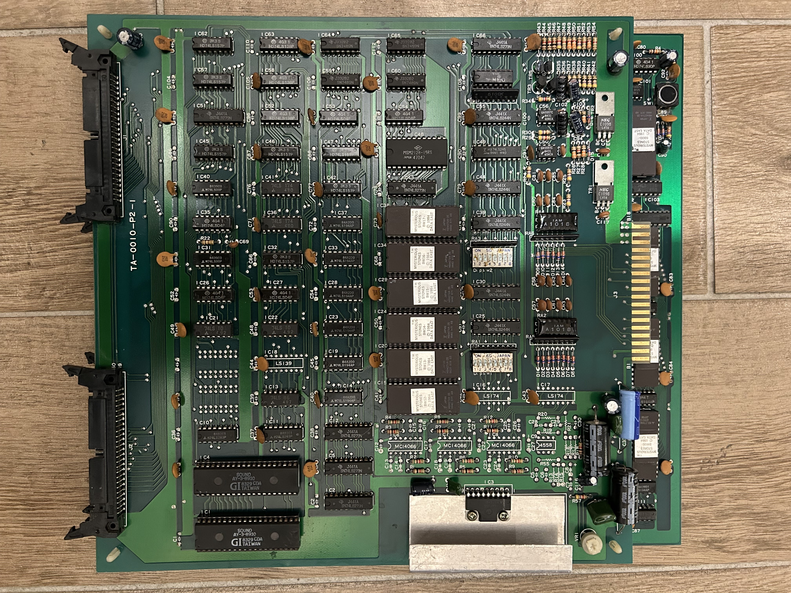
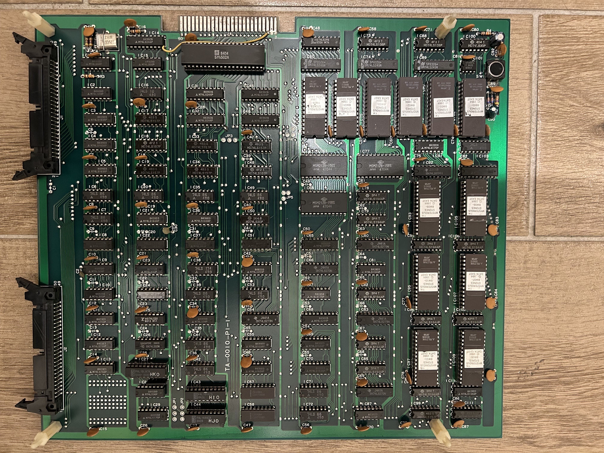

# Mysterious Stones — Hardware Reference

Technos Japan's **TA-0010** board set, drawing number K-10848 (sheet series "MPX-01"), dated
1985-06-04. Sourced from `board_spec.json` / `enrichment.json` in this directory plus a direct
review of all 18 cropped schematic pages in [`sch/`](sch/).

## Board set

Two physical PCBs, joined by two 40-of-50-pin flat cables (10 pins on each left open):

| Board | Role | Carries |
|-------|------|---------|
| **TA-0010-P1** ("btm bd") | CPU board | 6502A CPU, master oscillator, reset circuit, hsync/vsync generation, program ROM bank + bus decoding, sprite RAM/pattern address muxing, sprite tile ROMs + pixel shift registers, sprite Y-range compare, sprite line-buffer RAM + priority/color-select PALs |
| **TA-0010-P2** ("top bd") | I/O + video-output board | Dipswitch/IO decoder, player-control and coin connectors, the two AY-3-8910 PSGs + audio power amp, RGB DAC output stage, background tilemap address muxing + tile ROMs + pixel shift registers |

A third, separate header on the CPU board breaks out the raw 6502 bus (16-bit address bus,
8-bit data bus, R/W, phi2 clock) under `C`-prefixed net names (`CAD*`/`CDB*`/`C-phi2`) — almost
certainly a factory test or in-circuit-emulator connector, not used during normal play.

Known PCB revisions:
- TA-0010-P1-1 / TA-0010-P2-1 (Technos original)
- Itisa PCB (unlicensed Spanish clone — see [HISTORY.md](HISTORY.md#versions--romsets))

|  |  |
|:---:|:---:|
| TA-0010-P2 (top board) | TA-0010-P1 (bottom board) |

## CPU

| | |
|---|---|
| Part | **6502A** (2MHz-rated speed grade), confirmed by silkscreen on the CPU-board schematic |
| Clock | 12MHz master crystal / 8 = **1.5MHz** |
| Reset | NE555 power-on delay monostable + manual reset pushbutton |
| Interrupts | Maskable IRQ: software-timed, 16 pulses/frame, cleared by a write to `$2010` (see [MEMORY_MAP.md](MEMORY_MAP.md)). NMI: hardware, asserted directly on a coin-switch edge with no software acknowledge — confirmed on the schematic as a signal crossing both boards, and matches the FPGA core's own `mystston_main.v` (`nmi = ~coin[0] \| ~coin[1]`). |

## Clocks

Single 12MHz master crystal (470ohm/470ohm/0.1uF inverter-gate oscillator around X1), divided down:

| Derived clock | Divider | Feeds |
|---|---|---|
| 6MHz | /2 | Pixel clock (384x272 total raster, 256x240 visible, 57.44Hz refresh) |
| 1.5MHz | /8 | Main CPU (6502A) and both AY8910 PSGs |

## Video

- **DAC**: resistor ladder (weighted-resistor network) driven by 2SC1815 NPN transistors per
  channel (R41/R48-R54: 4.7k/3.3k/1.5k taps) — not a dedicated DAC IC. 3-3-2 RGB, 3-bit depth.
  Output connector J3: B13=Blue, A13=Green, A14=Red, B14=Sync (composite sync, not separate H/V).
- **Sync/timing generation**: built entirely from small-scale discrete 74LS-class counters and
  gates on the CPU board. No part matching "HMC20" (the custom chip a MAME driver comment
  speculates about) appears anywhere across the full 18-page schematic set — this weakens, though
  can't fully disprove, that speculation.
- **Sprite and background pixel generation** use the same technique on their respective boards:
  three pairs of 2764 tile ROMs feed 74LS273 latches and 74LS257 muxes into six 74LS194 (4-bit
  universal shift register) packages that serialize pixel data out in sync with the pixel clock.
  Each layer has its own address-mux stage merging the CPU's address bus with the raster-scan
  address so the same tile/sprite RAM can be written by the CPU and read by the scanner —
  conceptually the same shared-bus arbitration `mystston_obj.v` and the tilemap modules perform
  internally, just with real multiplexer ICs instead of FPGA dual-port RAM.
- **Sprite Y-range compare**: a bank of XOR gates compares each sprite's stored Y position against
  the current raster line to produce `OBJON`/`OBJLIN` — the hardware equivalent of
  `mystston_obj.v`'s own magnitude-compare check (`line - y < 16`).
- **Sprite line buffer**: two 2148-class (1Kx4) static RAMs combine into one 8-bit-wide per-scanline
  sprite pixel buffer — the real-hardware analogue of the FPGA core's own line-buffer arrays.
- **Layer priority / color select**: two **PAL16R4** chips plus one **PAL10L8** feed a 74LS374-class
  latch labeled `OBJCG` ("object color generator"). This is very likely where sprite/background
  priority and final color selection are actually decided on real hardware. Their fuse equations
  aren't recoverable from a schematic drawing (no JEDEC dump available for the parent board), so
  this can't be reverse-engineered further — but it does explain why layer-priority logic was
  never independently derivable from the schematic alone. The `myststonoi` (Itisa clone) romset in
  MAME does include dumps of the same part types (`pal10l8.bin`, `pal16r4-1.bin`, `pal16r4-2.bin`),
  confirming these PALs are a real, consistent feature of the design, not an Itisa-only addition —
  see [HISTORY.md](HISTORY.md#versions--romsets). The FPGA core's own priority order (foreground >
  sprites > background, in `mystston_colmix.v`) was derived independently from MAME driver source
  and confirmed against extensive hardware-monitor testing, not from reverse-engineering these PALs.
- **Palette**: 64 entries — low 32 are CPU-writable RAM, high 32 are hardwired from a 32-byte color
  PROM (`ic61`/`hlo`/`82s123`). Both halves feed the same RGB DAC described above.

## Audio

- Two AY-3-8910-equivalents, silkscreened `PSG1`/`PSG2` directly on the schematic.
- A two-latch (data + control) scheme feeds them — matches this core's own BC1/BDIR edge-detect
  emulation in `mystston_sound.v`.
- Outputs are mixed through a discrete resistor network (1K x3 per PSG bank into a shared 5.1K x6
  bank covering all 6 AY channels, then a final 1K resistor) ahead of a 10K volume potentiometer
  and a **Mitsubishi M51516** audio power-amp IC that drives the cabinet speaker.
- The external audio connector also carries -5V and +12V supply rails alongside the amplified
  Sound+/Sound- output.

## Inputs

- Each player control line (4-way joystick + 2 buttons + start) is diode+RC filtered ahead of
  74LS244-class buffering.
- Coin inputs are conditioned through 2SC1075 transistors and shaped by two separate NE555
  monostable timers (one per coin slot) before reaching the address decoder — real hardware
  debounce/pulse-shaping with no direct FPGA-core equivalent needed (coin inputs there are just
  synchronized and edge-detected digitally).

## Program ROM bus

Six 2764 EPROMs (8KB each, 48KB total) decoded through 74LS257-class address multiplexers and a
small decoder stage producing dedicated chip-select nets — among them `*BACK`, `*VRAM`,
`*ZERO`/`ZERO`, and `*I/O` (background RAM, video RAM, zero-page RAM, and I/O each get their own
select line) — confirming the conventional memory-map split already reflected in
[MEMORY_MAP.md](MEMORY_MAP.md), now cross-checked against real schematic net names rather than
only MAME driver source.

## Custom / semi-custom silicon

No mask-programmed custom chip identified. The closest things to "custom silicon" are the two
PAL16R4 + one PAL10L8 programmable-logic parts (undumped equations on the parent board) and the
32-byte color PROM — everything else on both boards is off-the-shelf 74-series TTL.
