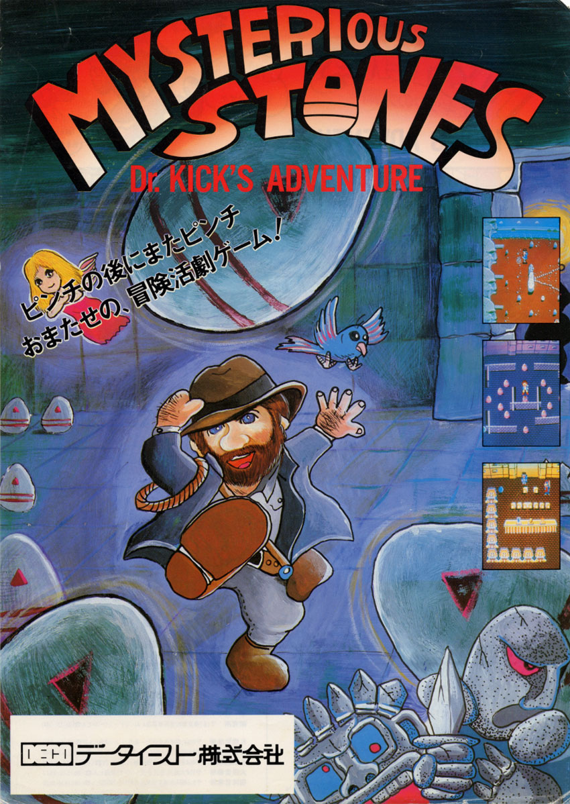
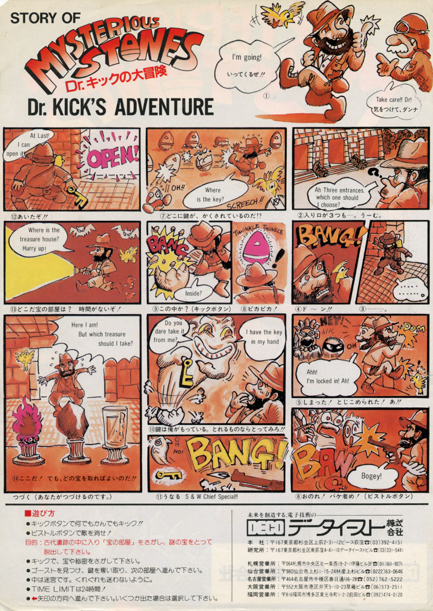
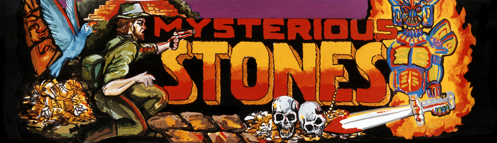
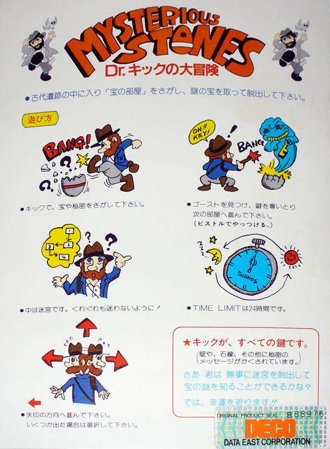
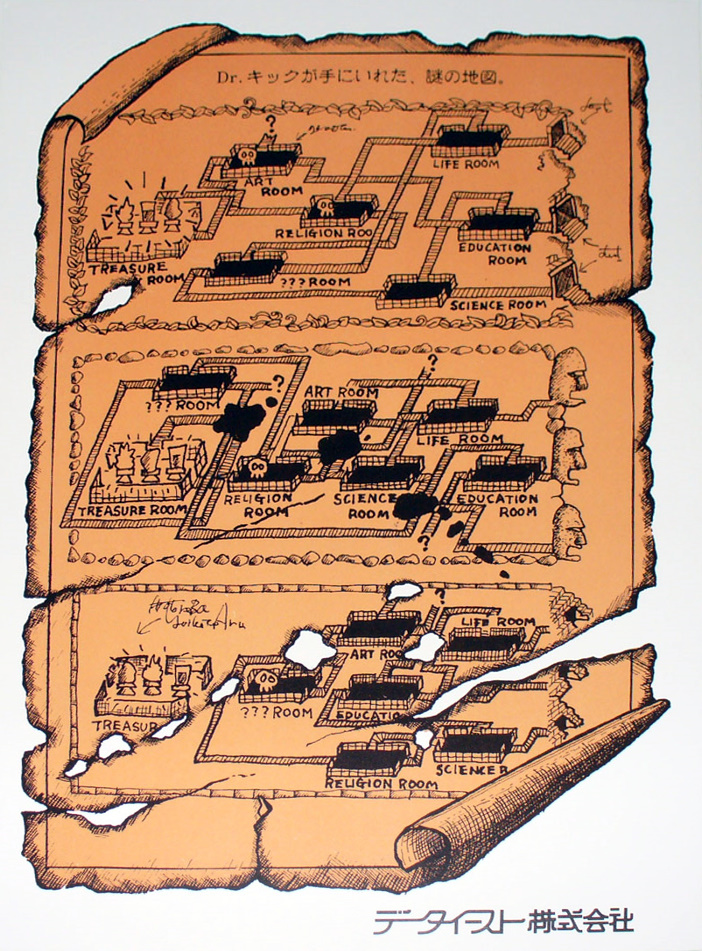

# Mysterious Stones — History & Versions

## Overview

**Mysterious Stones: Dr. John's Adventure** (c) 1984 Technos Japan Corp. — Game ID **TA-0010**.
Released November 1984, vertical arcade cabinet, 2 players, 4-way joystick, 2 buttons.

With this game, Technos Japan's developers pushed further the gameplay ideas from their earlier
*Eggs* / *Scrambled Egg*, wrapping them into an Indiana-Jones-themed, multi-room adventure.

Promotional and reference material (flyer, marquee, instruction card, level map) is archived in
[`extra/`](extra/):

|  |  |  |  |  |
|:---:|:---:|:---:|:---:|:---:|
| Flyer (front) | Flyer (back) | Marquee | Instructions card | Level map |

## Versions / romsets

Three MAME romsets exist for this hardware, all in `technos/mystston.cpp`, all rated
`status: good`, `emulation: good`, savestate-supported:

| Set | Description | Relation | Notes |
|-----|-------------|----------|-------|
| `mystston` | Mysterious Stones: **Dr. John's Adventure** | Parent | Current (newer) title/text |
| `myststono` | Mysterious Stones: **Dr. Kick in Adventure** | Clone of `mystston` | Older title; all 6 program-ROM banks have different CRCs from the parent (a full program-ROM rewrite, consistent with the different subtitle text and in-game message) |
| `myststonoi` | Mysterious Stones: Dr. Kick in Adventure (**Itisa PCB**) | Clone of `mystston` | Unlicensed Spanish bootleg/second-source board. Program ROM matches `myststono` in 5 of 6 banks exactly, differing only in the bank at `$4000`. Its dump additionally includes PAL equations: `pal10l8.bin`, `pal16r4-1.bin`, `pal16r4-2.bin` (2 identical PAL16R4 dumps, `crc c57555d0` both) |

The subtitle differs between the old and new version: the newer set says "Dr. John's Adventure",
the older says "Dr. Kick In Adventure". The older set's in-game secret message (see Trivia below)
is also displayed in Japanese katakana instead of English — evidence the older set was meant for
the Japanese market only.

Graphics ROMs (`fgtiles_sprites`, `bgtiles`) and the color PROM are byte-for-byte identical (same
CRCs) across all three sets — only the ROM chip labels differ between sets there. The program ROM
is the one region that actually differs in content (see table above). Each set's full ROM region
list is in `board_spec.json`'s `roms.sets`. The `.mra` files in this core expect MAME's **merged**
romset for this driver — a single `mystston.zip` archive (named after the parent) that already
bundles every variant's ROMs together — rather than three separate split zips; see the top-level
README's ROMs section.

The two PAL16R4 + one PAL10L8 parts dumped for `myststonoi` are the same part types found on the
**original** TA-0010 schematic's sprite line-buffer/priority page (see
[HARDWARE.md](HARDWARE.md#video)) — i.e. these PALs are a
real feature of the base design, not something the Itisa clone added; they just happen to only be
dumped/preserved for that variant in MAME's romset.

## Trivia

Hitting the lonely idol statue in the opening screen with a headbonk reveals a secret message:
*"A short cut to a treasure room. Go into an upper or a lower entrance. And... Go on left!"* — a
hint about the game's map layout.

## MAME driver timeline (`technos/mystston.cpp`)

Selected highlights from the driver's change history (full text preserved in
`board_spec.json`'s `mame.mameinfo`):

- **0.25** (Nicola Salmoria) — original driver added. Playable with accurate colors, no sound.
- **0.28** — high score saving added.
- **0.34b3** — 2x AY-8910 sound added.
- **0.36b4** — color fixes; color PROM and "Demo Sounds" dipswitch added.
- **2003-11-25** (Curt Coder) — correct video timings added.
- **0.66** (David Haywood) — `mystston` (set 1) added; existing set renamed to `myststno`; a newer
  ROM revision added later the same year.
- **0.77u2** (Curt Coder) — driver improved based on schematics; VSync corrected to 57.444855Hz;
  "Flip Screen" dipswitch added, replacing the previous "Unknown" dipswitch placeholders.
- **2006-04-21** (David Haywood) — fixed a long-standing bug (broken since ~0.77u2) in
  `mystston_videoram2_w`: it was checking the wrong videoram region before deciding whether to
  skip a write, causing missing/corrupt tiles from early in the first level onward.
- **0.105u3** — missing GFX tiles fixed; 6x "Unused" dipswitches added.
- **0.113u2** — VSync corrected to 57.444853Hz (the value still used today).
- **0.123u4** (Zsolt Vasvari) — "full treatment" pass: VSync/palette-size changes (later reverted
  by 0.113u2/0.36b4-era values).
- **0.133u1** — `myststno` renamed to `myststono`.
- **0.135u4** (Kold666) — fixed music running faster than the original PCB; VSync re-corrected to
  match real hardware.
- **0.141u1** — DIP switch locations documented.
- **0.149** — `myststonoi` (Itisa PCB clone) added.
- **0.199–0.247** — internal cleanups (device usage, macro removal, driver consolidation into a
  single file); no behavioral changes.
- **0.288** — TODO notes added: vblank flag polarity and vcount timing flagged as still not fully
  understood by the MAME driver author; description strings updated to their current form.

## Recommended next reading

- [HARDWARE.md](HARDWARE.md) — board/PCB technical reference, drawn from direct schematic review
- [MEMORY_MAP.md](MEMORY_MAP.md) — CPU memory map, I/O registers, dipswitches
- [IMPLEMENTATION.md](IMPLEMENTATION.md) — how this maps onto the JTFRAME-based FPGA core
